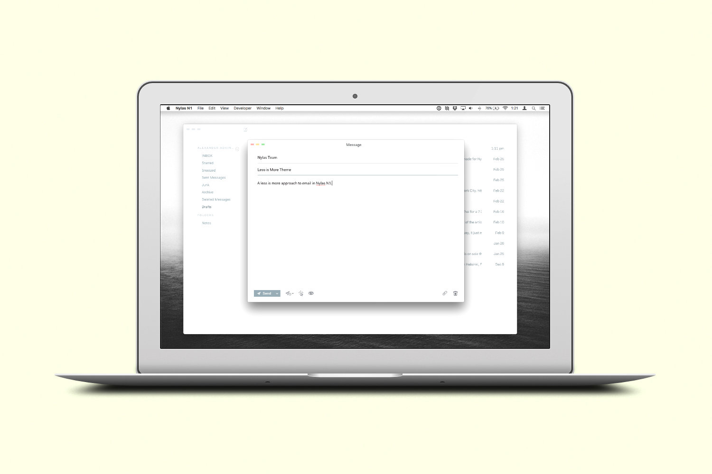

# Less is More
A less is more approach to email using [Nylas N1](https://nylas.com/n1).

[More images can be found at →](http://www.alexanderadkins.com/projects/less-is-more)

## Installation

[Download less-is-more](https://github.com/P0WW0W/less-is-more/archive/master.zip)

##### Step 1
Unzip `less-is-more-master.zip`.

##### Step 2
Open the Nylas N1 Preferences panel with <kbd>Cmd</kbd> + <kbd>,</kbd> or `Nylas N1 > Preferences` and choose `Install a theme…` from the `Select Theme` dropdown.

##### Step 3
Select the `less-is-more-master` folder and press `Open`. N1 will make a copy of the theme files into your `.nylas/packages` directory, notify you that the theme has been installed, and open it a new Finder window.

If you need to get back to the package files, they're located at `/Users/<yourUsername>/.nylas/packages/less-is-more-master`. Either use Terminal or you can open a Finder window and press <kbd>Cmd</kbd> + <kbd>Shift</kbd> + <kbd>G</kbd> and paste the path in, replacing `<yourUsername>` with your username.

### Credits
A special thank you to Jamie Wilson (jamie@jamiewilson.io) for creating the foundation for this theme. His Darkside Nylas N1 theme can be found at [Darkside Theme](http://www.jamiewilson.io/darkside)

### Feedback
Don't hesistate to get in touch with comments, feedback, issues, whatever. I can be contacted at [alexander.adkins@icloud.com](mailto:alexander.adkins@icloud.com?subject=Re: less-is-more).
